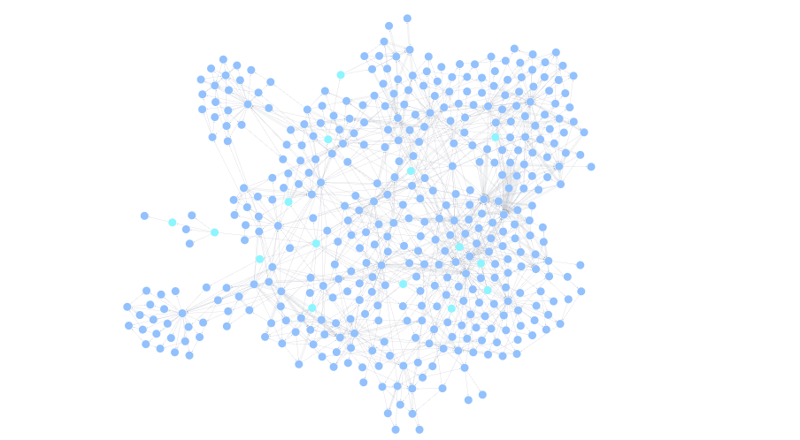
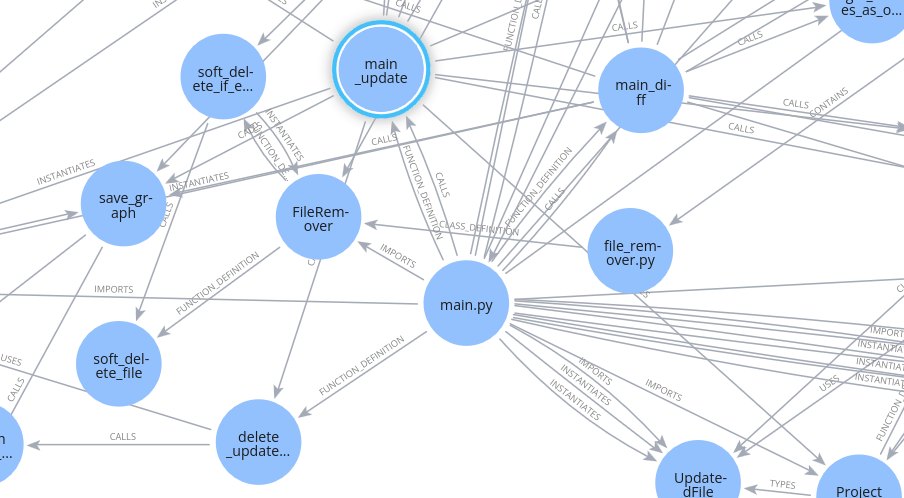

# How We Built a Tool to Turn Any Codebase into a Graph of Its Relationships

Software development is a complex and intricate process. It involves multiple people, teams, and technologies, all working together to create a product. As the codebase grows, it becomes increasingly difficult to understand how different parts of the system interact with each other. Code bases often become interconnected  webs of dependencies, hierarchies, and communication flows. Without a clear map, understanding the relationships between modules, functions, and files can be a daunting task. This lack of visibility can lead to longer debugging times, inefficient collaboration, and even the accidental introduction of bugs.

What if you could visualize your codebase as a graph? What if you could see how different parts of the system are connected, and how changes in one part of the codebase affect other parts? What if you could use this graph to navigate your codebase, understand its structure, and identify potential issues before they become problems? That is exactly what we set out to build.

I will share how we built this tool, the challenges we faced, decisions we made and lessons we learned along the way.


## Breaking Down the Problem: Hierarchy and References

At the core of any codebase are two fundamental relationships: hierarchy and references.

- Hierarchy refers to the structure of the codebase, such as how files are organized into directories, how classes are nested within each other, and how functions are defined within classes.

- References refers to how different parts of the codebase interact with each other, such as function calls, variable assignments, and imports.

To accurately extract and represents these relationships, we decided to divide the problem into two main steps:

```python
class ProjectGraphCreator:
    # ...
    def build(self) -> Graph:
        self.create_code_hierarchy() # Step 1: Hierarchy
        self.create_relationships_from_references_for_files() # Step 2: References
        return self.graph
    # ...
```

### Step 1: Building the hierarchy with tree-sitter

With the help of **tree-sitter**, a parsing library that can generate abstract syntax trees (ASTs) for code in various programming languages, we were able to extract the hierarchical structure of the codebase.
By parsing the code and analyzing the AST, we could identify folders, files, classes, functions, and methods, and create a graph that represents their containment relationships.

- Folders and files: provide the top-level structure of the codebase.
```python
    def create_code_hierarchy(self):
        # ...
        for folder in self.project_files_iterator:
            self.process_folder(folder)
        # ...

    def process_folder(self, folder: "Folder") -> None:
        folder_node = self.add_or_get_folder_node(folder)

        folder_nodes = self.create_subfolder_nodes(folder, folder_node)
        folder_node.relate_nodes_as_contain_relationship(folder_nodes)

        self.graph.add_nodes(folder_nodes)

        files = folder.files
        self.process_files(files, parent_folder=folder_node)
```


- Definitions within files, such as classes, functions and methods: provide the internal structure of the codebase.

```python
def process_files(self, files: List["File"], parent_folder: "FolderNode") -> None:
    for file in files:
        self.process_file(file, parent_folder)

def process_file(self, file: "File", parent_folder: "FolderNode") -> None:
    tree_sitter_helper = self._get_tree_sitter_for_file_extension(file.extension)
    # ...

    # After finding the tree-sitter helper for the file, we can create the nodes that the file defines, such as classes, functions, and methods.
    file_nodes = self.create_file_nodes(
        file=file, parent_folder=parent_folder, tree_sitter_helper=tree_sitter_helper
    )
    self.graph.add_nodes(file_nodes)

    # ...
```

The result of this step is a graph that represents the hierarchical structure of the codebase, with nodes representing folders, files, classes, functions, and methods, and edges representing the containment relationships between them.

Here is an example of our own codebase visualized as a graph after this step:


If we zoom in, we can see the internal structure of a file, with classes, functions, and methods:


### Step 2: Finding references with the Language Server Protocol

The next step is to find references between different parts of the codebase. This involves analyzing the code to identify function calls, variable assignments, and imports, and creating edges in the graph to represent these relationships.

Luckily, we can leverage the **Language Server Protocol (LSP)** to perform this analysis.
The LSP is a protocol that allows IDEs and code editors to communicate with language servers, which provide language-specific analysis and tools.
By using the LSP, we can extract references from the codebase without having to implement language-specific parsers and analyzers.

```python
    def create_relationships_from_references_for_files(self) -> None:
        file_nodes = self.graph.get_nodes_by_label(NodeLabels.FILE)
        self.create_relationship_from_references(file_nodes)

    def create_relationship_from_references(self, file_nodes: List["Node"]) -> None:
        references_relationships = []
        total_files = len(file_nodes)

        for index, file_node in enumerate(file_nodes):
            # ...
            nodes = self.graph.get_nodes_by_path(file_node.path)
            for node in nodes:
                # ...
                references_relationships.extend(
                    self.create_node_relationships(node=node, tree_sitter_helper=tree_sitter_helper)
                )
            # ...
        self.graph.add_references_relationships(references_relationships=references_relationships)

    def create_node_relationships(self, node: "Node", tree_sitter_helper: TreeSitterHelper) -> List["Relationship"]:
        references = self.lsp_query_helper.get_paths_where_node_is_referenced(node)
        relationships = RelationshipCreator.create_relationships_from_paths_where_node_is_referenced(
            references=references, node=node, graph=self.graph, tree_sitter_helper=tree_sitter_helper
        )

        return relationships
```

By querying the LSP for references to each node in the graph, we can create edges that represent the relationships between different parts of the codebase.

Even though the LSP provides a powerful way to extract references, it does not specify how is the reference being made. For example, it does not tell us if a reference is a function call, a variable assignment, or an import. To address this, we use tree-sitter to analyze the code and determine the type of reference.

Also, not all LSP implementations provide the exact same set of features (

```python
class RelationshipCreator:
    @staticmethod
    def create_relationships_from_paths_where_node_is_referenced(
        references: list["Reference"], node: "Node", graph: "Graph", tree_sitter_helper: "TreeSitterHelper"
    ) -> List[Relationship]:
        relationships = []
        for reference in references:
            # ...

            found_relationship_scope = tree_sitter_helper.get_reference_type(
                original_node=node, reference=reference, node_referenced=node_referenced
            )

            # ...
            relationships.append(relationship)
        return relationships

class TreeSitterHelper:
    def get_reference_type(
        self, original_node: "DefinitionNode", reference: "Reference", node_referenced: "DefinitionNode"
    ) -> FoundRelationshipScope:
        # ...
        found_relationship_scope = self.language_definitions.get_relationship_type(
            node=original_node, node_in_point_reference=node_in_point_reference
        )
        # ...

        return found_relationship_scope

```

For each language, we define a set of node types that represent different kinds of references, such as function calls, variable assignments, and imports. We then go up the AST from the reference to find the nearest node that matches one of these types, and use it to determine the type of relationship.

```python
class PythonDefinitions(LanguageDefinitions):
    def get_relationship_type(node: GraphNode, node_in_point_reference: Node) -> Optional[FoundRelationshipScope]:
        return PythonDefinitions._find_relationship_type(
            node_label=node.label,
            node_in_point_reference=node_in_point_reference,
        )

    def _find_relationship_type(node_label: str, node_in_point_reference: Node) -> Optional[FoundRelationshipScope]:
        relationship_types = PythonDefinitions._get_relationship_types_by_label()
        relevant_relationship_types = relationship_types.get(node_label, {})

        return LanguageDefinitions._traverse_and_find_relationships(
            node_in_point_reference, relevant_relationship_types
        )

class LanguageDefinitions:
    def _traverse_and_find_relationships(node: Node, relationship_mapping: dict) -> Optional[FoundRelationshipScope]:
        while node is not None:
            relationship_type = LanguageDefinitions._get_relationship_type_for_node(node, relationship_mapping)
            if relationship_type:
                return FoundRelationshipScope(node_in_scope=node, relationship_type=relationship_type)
            node = node.parent
        return None
```

The result of this step is a graph that represents the relationships between different parts of the codebase

Here is an example of our own codebase visualized as a graph after this step:



It is a little bit more messy, since it shows all the references between different parts of the codebase, but it provides a lot of insights into how different parts of the codebase interact with each other.

Here is a zoomed-in view of `main.py`:



As we can expect, the `main.py` file has a lot of references to other parts of the codebase.

## Conclusion

Codebases are complex, messy, tangled webs of relationships.

