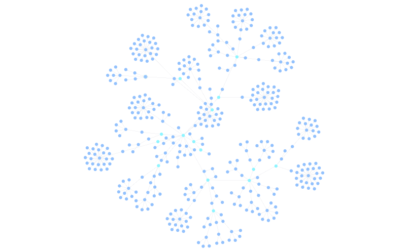
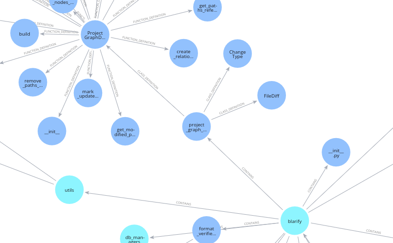

# How We Built a Tool to Turn Any Codebase into a Graph of Its Relationships

Software development is a complex and intricate process. It involves multiple people, teams, and technologies, all working together to create a product. As the codebase grows, it becomes increasingly difficult to understand how different parts of the system interact with each other. Code bases often become interconnected  webs of dependencies, hierarchies, and communication flows. Without a clear map, understanding the relationships between modules, functions, and files can be a daunting task. This lack of visibility can lead to longer debugging times, inefficient collaboration, and even the accidental introduction of bugs.

What if you could visualize your codebase as a graph? What if you could see how different parts of the system are connected, and how changes in one part of the codebase affect other parts? What if you could use this graph to navigate your codebase, understand its structure, and identify potential issues before they become problems? That is exactly what we set out to build.

We will share how we built this tool, the challenges we faced, decisions we made and lessons we learned along the way.


## Breaking Down the Problem: Hierarchy and References

At the core of any codebase are two fundamental relationships: hierarchy and references.

- Hierarchy refers to the structure of the codebase, such as how files are organized into directories, how classes are nested within each other, and how functions are defined within classes.

- References refers to how different parts of the codebase interact with each other, such as function calls, variable assignments, and imports.

To accurately extract and represents these relationships, we decided to divide the problem into two main steps:

```python
class ProjectGraphCreator:
    # ...
    def build(self) -> Graph:
        self.create_code_hierarchy() # Step 1: Hierarchy
        self.create_relationships_from_references_for_files() # Step 2: References
        return self.graph
    # ...
```

### Step 1: Building the hierarchy with tree-sitter

With the help of tree-sitter we broke down the codebase into its hierarchical structure.

- Folders and files: provide the top-level structure of the codebase.
```python
    def create_code_hierarchy(self):
        # ...
        for folder in self.project_files_iterator:
            self.process_folder(folder)
        # ...

    def process_folder(self, folder: "Folder") -> None:
        folder_node = self.add_or_get_folder_node(folder)

        folder_nodes = self.create_subfolder_nodes(folder, folder_node)
        folder_node.relate_nodes_as_contain_relationship(folder_nodes)

        self.graph.add_nodes(folder_nodes)

        files = folder.files
        self.process_files(files, parent_folder=folder_node)
```


- Definitions within files, such as classes, functions and methods: provide the internal structure of the codebase.

```python
def process_files(self, files: List["File"], parent_folder: "FolderNode") -> None:
    for file in files:
        self.process_file(file, parent_folder)

def process_file(self, file: "File", parent_folder: "FolderNode") -> None:
    tree_sitter_helper = self._get_tree_sitter_for_file_extension(file.extension)
    # ...

    # After finding the tree-sitter helper for the file, we can create the nodes that the file defines, such as classes, functions, and methods.
    file_nodes = self.create_file_nodes(
        file=file, parent_folder=parent_folder, tree_sitter_helper=tree_sitter_helper
    )
    self.graph.add_nodes(file_nodes)

    # ...
```

The result of this step is a graph that represents the hierarchical structure of the codebase, with nodes representing folders, files, classes, functions, and methods, and edges representing the containment relationships between them.

Here is an example of our own codebase visualized as a graph after this step:




If we zoom in, we can see the internal structure of a file, with classes, functions, and methods:



### Step 2: Finding references with the Language Server Protocol
